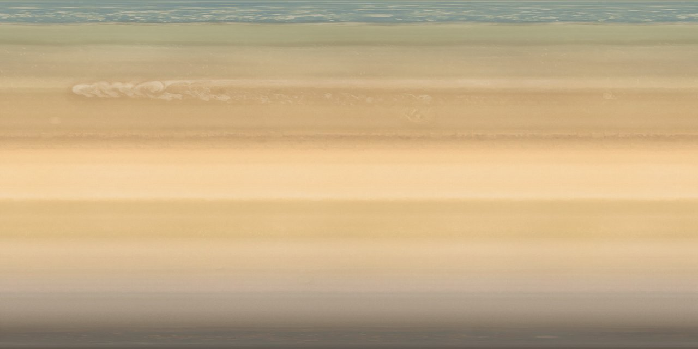

# Wangyi-Anime [Saturn Discovery]


## 1. Environment Config

&emsp;Version: ***Unity 2021.3.12f1*** 

&emsp;Template: ***3D (HDRP)***


## 2. Scene Structure


### 2.3 Image Sources

#### - **Lens Flare Texture of the Sun**
&emsp;*Author: [Richard Morgan](https://rpmorgan.medium.com/)*

&emsp;*Image Source Link: https://rpmorgan.medium.com/create-a-lens-flare-in-unity-2021-using-hdrp-c31d6d3fe3ee*

&emsp;*Image Usage License: from Richard Morgan*

```
Feel free to use the above images I created for the Lens Flare (SRP). I created them with PhotoShop using Legacy Gradients for the rings and a free lens flare brush for the shimmer found here:
https://www.brusheezy.com/brushes/57378-free-lens-flares-photoshop-brushes-2
```

<br />

#### - **Surface Map of Saturn**

&emsp;*Author: [ESO Supernova](https://supernova.eso.org/exhibition/images/SATURN-CC/)* &emsp;&emsp;*Credit: NASA*

&emsp;*Size: 16667×8333 or 30 MB*

&emsp;*Image Source Link: https://supernova.eso.org/exhibition/images/SATURN-CC/*

&emsp;*Image Usage License:	from [ESO COPYRIGHT](https://www.eso.org/public/outreach/copyright/)*

```
- If you want to use our materials without having to pay, the full image or footage credit must be presented in a clear and readable manner to all users, with the wording unaltered (for example: "ESO/José Francisco (josefrancisco.org)". The credit should not be hidden or disassociated from the image footage. Links should be active if the credit is online. See the copyright Q&A section on this page for guidance.
- The text of press releases, announcements, pictures of the week and captions should be credited to ESO or, when used by the media, ESO should be mentioned in the article or piece. 
- ESO materials, images and videos may not be used to state or imply the endorsement by ESO or any ESO employee of a commercial product or service;
- We welcome a copy of the product sent to us to be indexed in our archive;
- If an image includes a picture of an identifiable person, using that image for commercial purposes is not permitted.
```

*&emsp;Thumbnail of Image*



<br />

#### - **Rings of Saturn**

&emsp;*Author*: *[Niko22966](https://www.deviantart.com/niko22966)* 

&emsp;*Size: 10000×10000 or 382 MB* (Thus you might have to use Git LFS)

&emsp;*Image Source Link: https://www.deviantart.com/niko22966/art/Rings-of-Saturn-419585311*

&emsp;*Image Usage License:	from Niko22966*

```
- You are allowed to use my stock in any of your own works.
- You are allowed to alter my stock in any way you please.
- If you use my stock, please comment on the stock used.
Include a link to the work you used it in and in the work's description, a statement or link indicating where the stock came from.
- Please don't use any of my stock to create any other stocks.
- You are allowed to use my stock in prints.

P.S: This image is a generated image based on a [NASA PHOTO](https://photojournal.jpl.nasa.gov/catalog/PIA08389) produced by [Cassini Imaging Team](http://ciclops.org/)
```

&emsp;*Thumbnail of Image*


